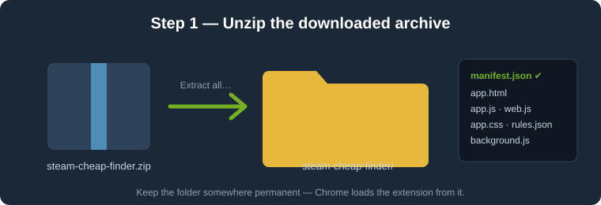
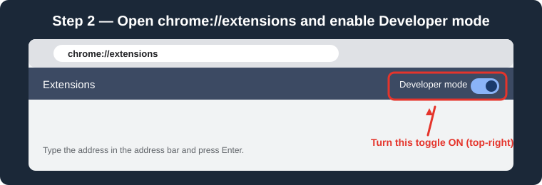
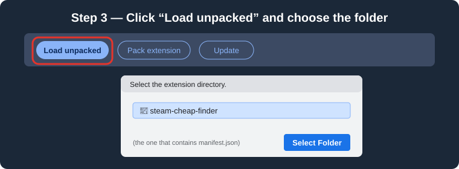
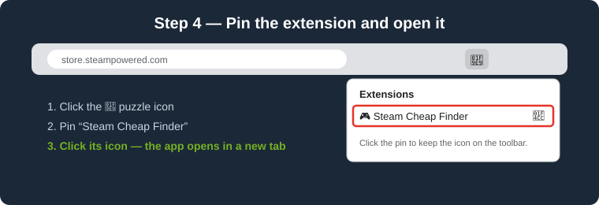

# 🎮 Steam Cheap Finder

A Chrome extension that finds the cheapest games on Steam, hides the ones you already own, shows the total cost before you buy, and adds your picks to the Steam cart. A second tab compares prices across other legit stores.

> The images below are schematic illustrations of each step, not exact screenshots — your Chrome version may look slightly different.

---

## Installation (Chrome / Edge / Brave / any Chromium browser)

The extension is installed manually ("unpacked"), so you do not need the Chrome Web Store.

### 1. Download and unzip

Download `steam-cheap-finder.zip` and extract it (right-click → *Extract all…*).
Keep the extracted folder somewhere permanent — Chrome loads the extension directly from it. If you move or delete the folder, the extension stops working.

### 2. Enable Developer mode

Open a new tab, type `chrome://extensions` in the address bar and press Enter.
Turn on the **Developer mode** toggle in the top-right corner.

### 3. Load the extension

Click **Load unpacked** and select the `steam-cheap-finder` folder (the one that contains `manifest.json`, not a parent folder).
If Chrome asks for permission to access `store.steampowered.com` and `www.cheapshark.com`, accept.

### 4. Pin and open

Click the 🧩 puzzle icon in the toolbar, pin **Steam Cheap Finder**, and click its icon. The app opens in a new tab.

---

## Before you start

- **Log in to Steam** at https://store.steampowered.com in the same browser. The extension uses your existing Steam session to see which games you own and to add games to your cart. Your password is never read or stored.
- If the top-right corner says it can't see your library, log in and reload the extension tab.

## How to use

**🛒 Steam store tab**
1. Set filters: name, price range, price region, *only on sale*, *only with trading cards*, *hide owned*.
2. Click **Find**. Results are sorted from cheapest (or cheapest with the best reviews).
3. Tick the games you want, or use **Select all visible** / **Auto-select** (by count and/or budget).
4. The bottom bar shows the running total.
5. Click **Add to Steam cart**, then **Open cart** to check out.

**🌐 Whole internet tab**
Compares prices from Steam, Humble, Fanatical, Green Man Gaming and other stores (data from [CheapShark](https://www.cheapshark.com), prices in USD). Select games and click **Open selected in stores** to open their store pages.

## Updating

Replace the old folder with the new version, open `chrome://extensions`, click the ↻ reload button on the extension card, then reload the extension tab.

## Troubleshooting

| Problem | Fix |
|---|---|
| "Can't see your library" | Log in at store.steampowered.com, then reload the extension tab. |
| "No sessionid cookie" | Open any Steam store page once while logged in. |
| A game was not added to the cart | Open its store page manually (a link appears in the log). Steam may have changed its cart system; some games also require an age check — confirm your age on the game's page once. |
| Extension disappeared after restart | You moved or deleted the folder. Load it again via *Load unpacked*. |
| Prices differ from the cart | The *Price region* option is for browsing only; the cart always uses your account's region. |

## Notes

- Adding to the cart uses an unofficial Steam endpoint and may stop working if Steam changes it.
- The extension does not buy anything — checkout always happens on the store's own website.
- Only legitimate stores are listed; key resellers such as G2A or Kinguin are not included.
